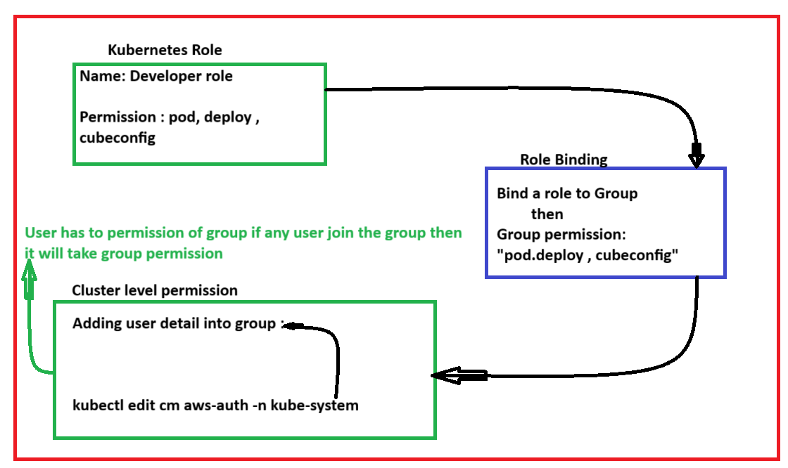

# Kubernetes Rollback # 

- create a iam role with eks cluster permission

- Rollback use when you want to give access of eks cluster to another user.

- If cluster created by ec2 then .kube file inside iam role detailes are updated and 
- If cluster created by user means laptop then .kube file inside user's access and secret key are configured.

- If you want to give any user to cluster permission then create an iam user and attach specific permission to user and give that user accesskey and secret key to your coolig or anyone.

- But ec2 inside users access key and secret key configuration is not best practice then 
- If you want to create new ec2 and give that ec2 to eks permission then create iam role and attach specific permission and attach that role to new ec2 instance 

- after giving access user's need to update cluster and get access 

- In above case one thing is mandatory :
- main ec2 which create a cluster that ec2 inside edit aws-auth file and add role or user detail is mandatory condition.
- it means whatever users and roles are in the aws-auth file mapped that all have specific pemission of cluster.

# If you create a user with admin permisssion but not add in aws-auth then user could not acces the cluster 
- admin access is aws permission means cluster outer permission not kubernetes permission means 
- kubectl not work in his michine but eksctl work 
- kubectl only work when cluster owner add that user's detail in aws-auth file.


- when owner add detail of user or role then after they need only update cluster and access the cluster:
- ex: 
  
-  kubectl edit cm aws-auth -n kube-system

1. Cluster creaetd by ec2 -- Add iam role into aws-auth <-- give access to ec2 
2. Cluster created by local machine -- Add user details into aws-auth  <-- give access to local machine user 

# Process # 

- Step-1 Need to create IAM user with EKS cluster permission 

- Step-2 aws configure --profile IAMuser

 (AccessKey) 

 (SecretKey)

- step-3 create kuberenetes Role 

- step-4 cretae kuberentes role binding to bind role and group

- step-5 add usr arn into config map fil

- Role
==============================================================
```
apiVersion: rbac.authorization.k8s.io/v1
kind: Role
metadata:
  namespace: default
  name: developer-role
rules:
  - apiGroups: [""] # "" indicates the core API group ["apps"]
    resources: ["ConfigMap"]
    verbs: ["get", "list"]
  - apiGroups: [""] # "" indicates the core API group ["apps"]
    resources: ["pods"]
    verbs: ["get", "list",]
  - apiGroups: ["apps"]
    resources: ["deployments"]
    verbs: ["get", "list"]
```

- Role Binding to map role and group
==========================================
```
apiVersion: rbac.authorization.k8s.io/v1
kind: RoleBinding
metadata:
  name: read-pods
  namespace: default
subjects:
  - kind: Group
    name: "developer"
    apiGroup: rbac.authorization.k8s.io
roleRef:
  kind: Role
  name: developer-role
  apiGroup: rbac.authorization.k8s.io
```

#edit command and add belwow user details

- kubectl edit cm aws-auth -n kube-system

#aws auth config
===============================================
```
mapUsers: |
   - userarn: arn:aws:iam::483216680875:user/devops
     username: devops
     groups:
     - developer
```
```
kubectl get rb 
kubectl get rolebinding
kubectl api-resources
```

----for example below reference ------

```
apiVersion: v1
data:
  mapRoles: |
    - groups:
      - system:bootstrappers
      - system:nodes
      rolearn: arn:aws:iam::992382358200:role/eksctl-naresh-nodegroup-ng-bbb93ed-NodeInstanceRole-9GWNpfucPXRt
      username: system:node:{{EC2PrivateDNSName}}
  mapUsers: |
   - userarn: arn:aws:iam::483216680875:user/devops
     username: devops
     groups:
     - developer
kind: ConfigMap
metadata:
  creationTimestamp: "2024-03-22T02:22:59Z"
  name: aws-auth
  namespace: kube-system
  resourceVersion: "344678"
  uid: 8167447c-eb81-4108-8653-690369d98c4f
```


- aws eks update-kubeconfig --name test --profile devops  #user 

- aws eks update-kubeconfig --name naresh  #for defulat one

# 
